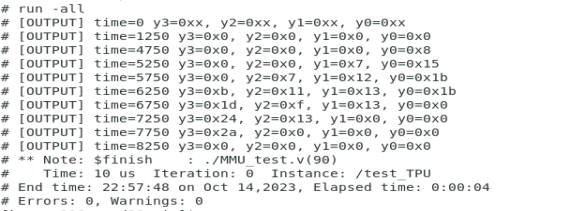
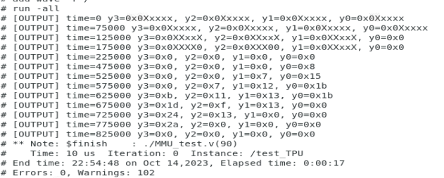

# systolic_4x4arr

This repo has the 4x4 Systolic Array implementation with a Weight Stationary Dataflow.

The simulations were run using scripts with modelsim commands. The following are the output activation values obtained from the array from an RTL Simulation.

The synthesis has been using Synopsys Design Compiler. The script has been provided in the synth folder.
The maximum possible frequency for this design is 909MHz, with an area of 101um2 and a power of 0.6mW.

The following are the output activation values obtained from the array from a Gate-Level Simulation.

