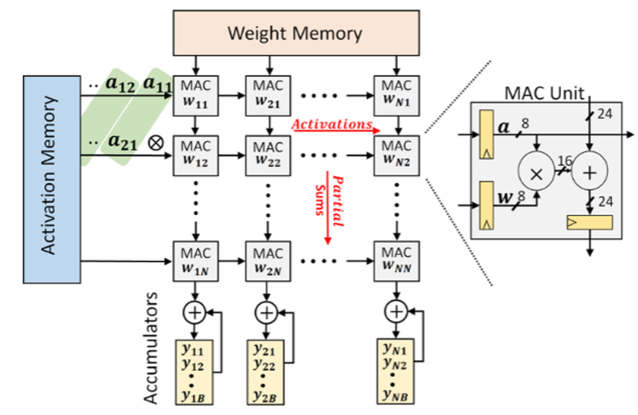

# systolic_4x4arr

This repo has the 4x4 Systolic Array implementation with a Weight Stationary Dataflow. The figure presented below describes the architecture of the design.



The Verilog source code files are present in the **rtl** folder and the testbench file along with scripts used to run them are present in the **sim** folder. The design compiler script and its synthesis results are present in the **synth** folder.

The simulations were run using scripts with modelsim commands. 

To run the rtl simulations, use script **vsim.sh**. The command to run is (from *sim* folder)
```
bash vsim.sh
```


The following are the output activation values obtained from the array from an RTL Simulation.


The synthesis has been using Synopsys Design Compiler. The script has been provided in the synth folder.

To run synthesis, use the following command from *synth* folder.
```
dc_shell -f synth.tcl -output_log_file syn.log
```

The maximum possible frequency for this design is 1GHz, with an area of 10103um2 and a power of 0.695mW.

To run the gate-level simulations, use script **vsim_gls.sh**. The command to run is (from *sim* folder)
```
bash vsim_gls.sh
```

The following are the output activation values obtained from the array from a Gate-Level Simulation.


Further work needs to be done to expand the design to support large number of MAC arrays.
